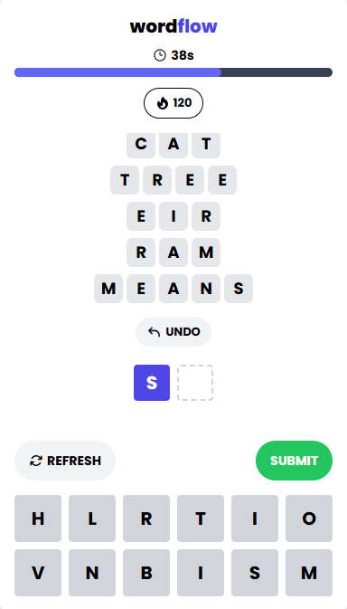

# WordFlow Bot

Introducing the WordFlow Bot — a script designed by me to automate gameplay for the online word game developed by [@mewtru](https://www.instagram.com/mewtru). This script intelligently submits valid words based on the letters available in the game, streamlining the experience.

> **Note:** This script is created out of curiosity and may reduce the fun and challenge of the game. For a more authentic experience, consider playing without it. However, feel free to try it out and see how it works!

## Features

- **Fetch Valid Words:** Retrieves a list of valid words from the TWL06 Scrabble Word List.
- **Auto-Submission:** Automatically submits valid words derived from the current set of letters in the game.
- **Dynamic Button Interaction:** Seamlessly interacts with the game’s interface to submit letters in the correct sequence.
- **Recursive Word Building:** Constructs potential words using available letters and validates them against the word list.

## Usage

1. **Download the Script:**

   - Copy the contents of the [script](wf-bot.js) to your clipboard or save it locally on your device

2. **Open the Game:**

   - Navigate to [mewtru.com/wordflow](http://mewtru.com/wordflow) in your web browser.

3. **Run the Script:**
   - Open the developer console by pressing F12 or by right-clicking on the page and selecting "Inspect."
   - Paste the script contents into the console.
   - Execute the following command to start the automation:
     ```javascript
     await start();
     ```

## Preview


